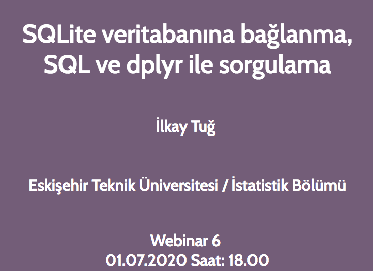

```{r setup, include=FALSE}
options(htmltools.dir.version = FALSE)
library(revealjs)
library(viridis)
```


```{r, echo=FALSE, out.width="50%"}
knitr::include_graphics('aim.png')
```
--

 - R-Ladies, R topluluğunda cinsiyet çeşitliliğini desteklemek için kurulmuş dünya çapında bir organizasyondur.


 - R kullanan ve geliştiren kadınlarla bir iletişim ortamı sağlamak
 


 - Kadınları R kodları yazmaya, paket geliştirmeye ve R konferanslarına konuşmacı olarak katılmaya teşvik etmek

---


```{r, echo=FALSE,out.width="50%", fig.align='center'}
knitr::include_graphics('global.png')
```


```{r, echo=FALSE, out.width="60%", fig.align='center'}
knitr::include_graphics('slide3.png')
```


---

R-Ladies Global


```{r, echo=FALSE, out.width="50%", fig.align='center'}
knitr::include_graphics('slide4.png')
```

R-Ladies Türkiye &#x21A0;

---


```{r, echo=FALSE,out.width="90%",fig.align='center'}
knitr::include_graphics('slide5.png')
```


  İstanbul, Eylül 2016
 

 
  Ankara, Haziran 2019
 

  Eskişehir, Ekim 2019
  
---


```{r, echo=FALSE,out.width="70%",fig.align='center'}
knitr::include_graphics('kurucular.png')
```


```{r, echo=FALSE,out.width="90%",fig.align='center'}

```


```{r, echo=FALSE,out.width="90%",fig.align='center'}

```


---

```{r, echo=FALSE,out.width="70%",fig.align='center'}
knitr::include_graphics('slide7.png')
```

```{r, echo=FALSE,out.width="10%",fig.align='left'}

```
https:/twitter.com/RLadiesEskisehR

https:/twitter.com/RLadiesIstanbul

https:/twitter.com/RLadiesAnkara


---

```{r, echo=FALSE,out.width="70%",fig.align='center'}
knitr::include_graphics('slide7.png')
```


```{r, echo=FALSE,out.width="10%",fig.align='left'}

```
https://www.meetup.com/rladies-eskisehir

https://meetup.com/rladies-ankara

https://meetup.com/rladies-istanbul


---

```{r, echo=FALSE,out.width="70%",fig.align='center'}
knitr::include_graphics('slide7.png')
```


```{r, echo=FALSE,out.width="10%",fig.align='left'}
knitr::include_graphics('insta.png')
```
https://www.instagram.com/rladies-ankara


---

```{r, echo=FALSE,out.width="30%",fig.align='center'}
knitr::include_graphics('youtube.png')
```


Webinar #1: https://youtu.be/A-zCgrfDavI

```{r, echo=FALSE,out.width="15%",fig.align='left'}
knitr::include_graphics('kayit1.png')
```


Webinar #2: https://youtube.com/watch?v=uCzPwMknOxQ

```{r, echo=FALSE,out.width="15%",fig.align='left'}

```


Webinar #4: https://www.youtube.com/watch?v=ykmoy3AO_qI&t=1063s

```{r, echo=FALSE,out.width="15%",fig.align='left'}

```


---

```{r, echo=FALSE,out.width="80%",fig.align='center'}

```

Slaytlar için R paketi [**revealjs**](https://bookdown.org/yihui/rmarkdown/revealjs.html) ile  [**knitr**](http://yihui.name/knitr) ve [R Markdown](https://rmarkdown.rstudio.com) kullanılmıştır.

---

```{r, echo=FALSE,out.width="70%",fig.align='center'}

```
